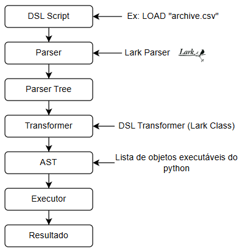
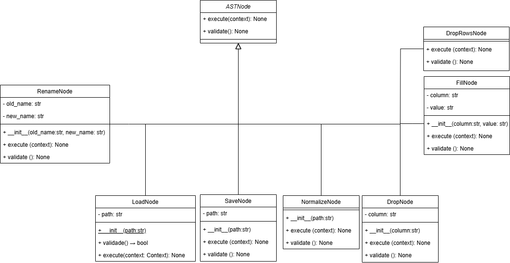

# Equipe
- Nicole Charron - nc@cin.upfe.br
- Pedro Didier Maranhão - pdm@cin.upfe.br

# Proposta/Objetivo do Projeto
Este projeto tem como objetivo desenvolver uma DSL (Domain-Specific Language) voltada para operações de carregamento, limpeza e normalização de dados.

A DSL será uma extensão da linguagem imperativa 1 do JavaCC, de forma que sua utilização seja intuitiva, permitindo que pessoas não técnicas em dados escrevam scripts em uma linguagem de alto nível e expressiva, sem precisarem conhecer a fundo cada detalhe da API do Pandas.
 
Quanto ao escopo, o propósito é oferecer uma DSL suficiente, capaz de lidar com múltiplas etapas do pipeline, como:
- Salvar e carregar datasets
- Limpeza de dados (tratamento de valores ausentes, remoção de colunas e renames)
- Normalizar valores (a nível de coluna)
- Transformação básica dos dados (a nível de coluna)
  

# Visão da BNF
Aqui está o diagrama de nossa DSL, com ênfase no que foi alterado pela equipe:

```
<program> ::= <statement>

<statement> ::= <load_stmt>
              | <clean_stmt>
              | <normalize_stmt>
              | <transform_stmt>
              | <save_stmt>
              | <statement> ";" <statement>

;-------------------------------------------------------
; Carregamento de dados
;-------------------------------------------------------
<load_stmt> ::= "LOAD" <string> ["AS" <identifier>]

;-------------------------------------------------------
; Limpeza de dados
;-------------------------------------------------------
<clean_stmt> ::= "CLEAN" <identifier> <clean_action>

<clean_action> ::= "DROP" <column_list>
                 | "FILL" <column_value_pairs>
                 | "DROPROWS" [ <column_list> ]
                 | "RENAME" <rename_pairs>
                 | "REPLACE" <identifier> <replace_pairs>

;-------------------------------------------------------
; Normalização de dados
;-------------------------------------------------------
<normalize_stmt> ::= "NORMALIZE" <identifier> [ <column_list> ]

;-------------------------------------------------------
; Transformação de dados
;-------------------------------------------------------
<transform_stmt> ::= "TRANSFORM" <identifier> <transform_action>

<transform_action> ::= "ADD" <numeric_pairs>
                     | "MULT" <numeric_pairs>

;-------------------------------------------------------
; Salvamento de dados
;-------------------------------------------------------
<save_stmt> ::= "SAVE" <identifier> "AS" <string>

;-------------------------------------------------------
; Definições auxiliares
;-------------------------------------------------------
<column_list> ::= <identifier>
                | <identifier> "," <column_list>

<column_value_pairs> ::= <column_value_pair>
                       | <column_value_pair> "," <column_value_pairs>

<column_value_pair> ::= <identifier> "=" <string>
                      | <identifier> "=" <number>

<rename_pairs> ::= <rename_pair>
                 | <rename_pair> "," <rename_pairs>

<rename_pair> ::= <identifier> "=" <identifier>

<replace_pairs> ::= <replace_pair>
                  | <replace_pair> "," <replace_pairs>

<replace_pair> ::= <string> "=" <string>

<numeric_pairs> ::= <numeric_pair>
                  | <numeric_pair> "," <numeric_pairs>

<numeric_pair> ::= <identifier> "=" <number>

<value> ::= <number>
          | <string>
          | <identifier>

<number> ::= [0-9]+ ( "." [0-9]+ )?

<identifier> ::= [a-zA-Z_][a-zA-Z0-9_]*

<string> ::= "\"" [^\"]* "\""
           | "'" [^']* "'"
```

Essa BNF ilustra apenas uma estrutura básica do que seria possível na linguagem. A ideia é permitir que o usuário escreva, por exemplo:

```
LOAD "dados.csv"
CLEAN DROP "coluna_x"
CLEAN FILL "idade" WITH 0
RENAME "nome" TO "nome_completo"
NORMALIZE
SAVE "saida.csv"
```
# [DESATUALIZADA] Arquitetura de funcionamento 



Passo a passo:

1. É dado um comando na DSL
2. Parser lê o texto DSL e gera uma árvore (parse tree)
3. Transformer traduz a parse tree para objetos úteis (AST)
4. Cada objeto da AST é uma classe que representa uma instrução da DSL em Python
5. Executor	executa os nós da AST usando pandas
6. Retorno do resultado para o usuário

# [DESATUALIZADA] Diagrama de Classes

Estrutura de classes da AST (Abstract Syntax Tree), ou seja, como as instruções da DSL vão ser representadas no código Python.



##### [DESATUALIZADA] Classe base
ASTNode 
 :arrow_right: Classe abstrata, que define a estrutura comum para todos os comandos.
 :arrow_right: Possui os métodos execute e validate, que devem ser sobrescritos por cada comando específico.

##### [DESATUALIZADA] Subclasses 
Cada comando da DSL é implementado como uma subclasse da ASTNode. 
 - LoadNode: Carrega um arquivo CSV.
 - SaveNode: Salva o DataFrame resultante.
 - NormalizeNode: Normaliza colunas numéricas ou transforma em categóricas
 - DropNode, FillNode, etc.: Realizam operações de limpeza, como remover colunas ou preencher valores ausentes.


