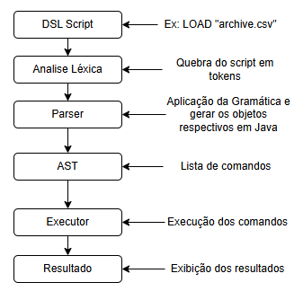

# Equipe
- Pedro Didier Maranhão - pdm@cin.upfe.br
- Nicole Charron - nc@cin.upfe.br

# Proposta/Objetivo do Projeto
Este projeto tem como objetivo desenvolver uma DSL (Domain-Specific Language) voltada para operações de carregamento, limpeza e normalização de dados.

 A DSL será traduzida para chamadas da biblioteca Pandas em Python, permitindo que pessoas não técnicas em dados escrevam scripts em uma linguagem de alto nível e expressiva, sem precisarem conhecer a fundo cada detalhe da API do Pandas.
 
 Quanto ao escopo, o propósito é oferecer uma DSL suficiente, capaz de lidar com múltiplas etapas do pipeline, como:
 - Normalização de valores
 - Salvamento e carregamento de datasets
 - Limpeza de dados (tratamento de valores ausentes, remoção de colunas e renames)
 - Transformação dos dados (PLUS)

 Para isso, será definida formalmente a gramática, criada uma arquitetura modular e implementado um parser que traduz as instruções da DSL para as operações correspondentes em Pandas.

# Visão Básica da BNF
Abaixo está um esboço simplificado (e não definitivo) de como a gramática da DSL poderia ser estruturada:

```
<program> ::= <statement_list>

<statement_list> ::= <statement>
                   | <statement> <statement_list>

<statement> ::= <load_stmt>
              | <clean_stmt>
              | <normalize_stmt>
              | <save_stmt>
              | <transform_stmt>

;-------------------------------------------------------
; 1) LOAD: Carrega um CSV em um DataFrame
;    Exemplo:
;    LOAD "data.csv" AS df_clientes
;-------------------------------------------------------
<load_stmt> ::= "LOAD" <string> ["AS" <identifier>]

;-------------------------------------------------------
; 2) CLEAN: Operações de limpeza no dataset
;    DROP: remove colunas
;    FILL: substitui dados faltantes em colunas específicas
;    DROPROWS: remove linhas com dados faltantes (pode ser geral ou por colunas)
;    RENAME: renomeia colunas
;
;    Exemplo:
;    CLEAN df_clientes DROP "sobrenome"
;    CLEAN df_clientes FILL "idade"=0
;    CLEAN df_clientes DROPROWS
;    CLEAN df_clientes RENAME "colAntiga->colNova"
;-------------------------------------------------------
<clean_stmt> ::= "CLEAN" <identifier> <clean_action_list>

<clean_action_list> ::= <clean_action>
                      | <clean_action> <clean_action_list>

<clean_action> ::= "DROP" <column_list>
                 | "FILL" <column_value_pairs>
                 | "DROPROWS" [ <column_list> ]
                 | "RENAME" <old_new_pair_list>

;-------------------------------------------------------
; 3) NORMALIZE: Normaliza um DataFrame. Se for coluna numérica => Standard Scaling;
;    se for coluna string => get_dummies (one-hot encoding).
;    Funciona em todo o DataFrame <identifier>.
;-------------------------------------------------------
<normalize_stmt> ::= "NORMALIZE" <identifier>

;-------------------------------------------------------
; 4) SAVE: Salva o DataFrame em arquivo CSV.
;    Exemplo:
;    SAVE df_clientes TO "resultado.csv"
;-------------------------------------------------------
<save_stmt> ::= "SAVE" <identifier> ["TO" <string>]

;-------------------------------------------------------
; 5) TRANSFORM: Aplica operações matemáticas em colunas, via pandas.DataFrame.apply ou diretamente.
;    Operações possíveis: ADD, SUB, MULT, DIV, POT
;    Exemplo:
;    TRANSFORM df_clientes WITH ADD "colA" 10 SUB "colB" "colC"
;
;    -> Interpretação:
;       df_clientes["colA"] = df_clientes["colA"] + 10
;       df_clientes["colB"] = df_clientes["colB"] - df_clientes["colC"]
;-------------------------------------------------------
<transform_stmt> ::= "TRANSFORM" <identifier> "WITH" <transform_op_list>

<transform_op_list> ::= <transform_op>
                      | <transform_op> <transform_op_list>

<transform_op> ::= ( "ADD" | "SUB" | "MULT" | "DIV" | "POT" )
                   <column_list>
                   <value>

;-------------------------------------------------------
; Definições auxiliares
;-------------------------------------------------------
<column_list> ::= <string>
                | <string> "," <column_list>

<column_value_pairs> ::= <column_value_pair>
                       | <column_value_pair> "," <column_value_pairs>

<column_value_pair> ::= <string> "=" <string>
                      | <string> "=" <number>

<old_new_pair_list> ::= <old_new_pair>
                      | <old_new_pair> "," <old_new_pair_list>

<old_new_pair> ::= <string> "->" <string>

<value> ::= <number>
          | <string>
          | <identifier>

<number> ::= [0-9]+ ( "." [0-9]+ )?  ; // Exemplo simples: 123 ou 123.45

<identifier> ::= [a-zA-Z_][a-zA-Z0-9_]*

<string> ::= "\"" [^\"]* "\""
           | "'" [^']* "'"
```

Essa BNF ilustra apenas uma estrutura básica do que seria possível na linguagem. A ideia é permitir que o usuário escreva, por exemplo:

```
LOAD "dados.csv"
CLEAN DROP "coluna_x"
CLEAN FILL "idade" WITH 0
RENAME "nome" TO "nome_completo"
NORMALIZE
SAVE "saida.csv"
```
# Arquitetura de funcionamento 



Passo a passo:

1. É dado um comando na DSL
2. Parser lê o texto DSL e gera uma árvore (parse tree)
3. Transformer traduz a parse tree para objetos úteis (AST)
4. Cada objeto da AST é uma classe que representa uma instrução da DSL em Python
5. Executor	executa os nós da AST usando pandas
6. Retorno do resultado para o usuário


